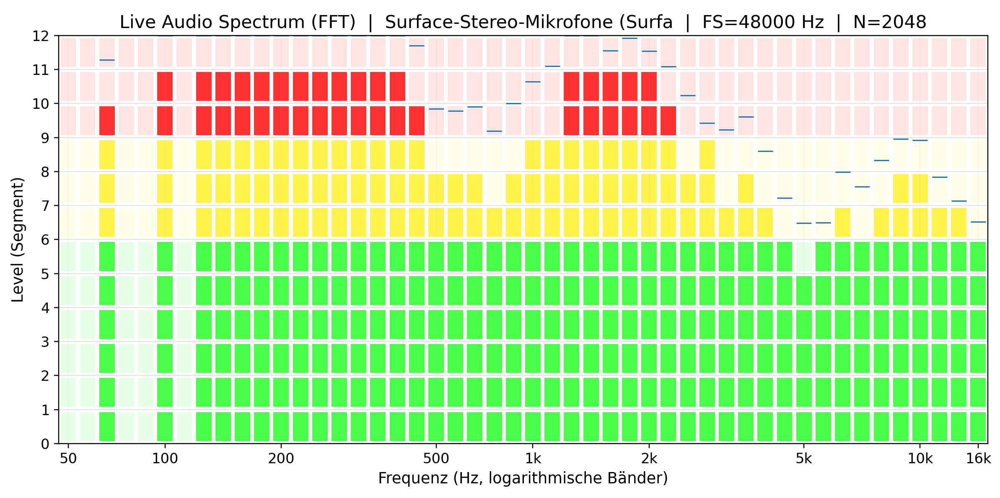
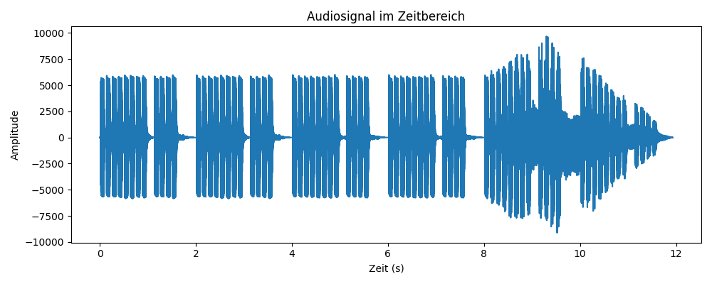
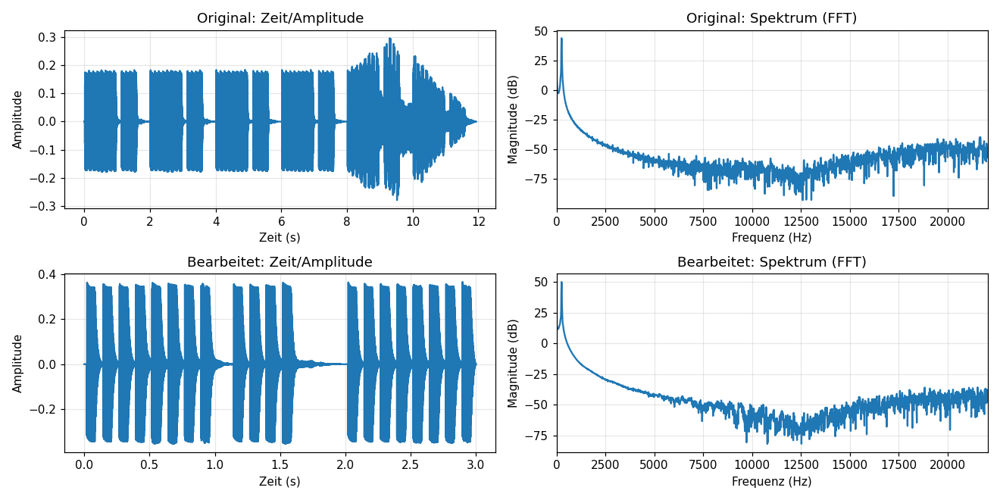

# 13.01.2026
Idee überlegen

Bibliotheken herunterladen

Code von KI generieren lassen

Probelauf des Programmes:

  

# 20.01.2026

Dokumentation über den aktuellen Stand

# 27.01

Erweiterung des aktuellen Programms:

Töne werden in unterschiedlichen Farben angezeigt, je nach Höhe der Töne wird entschieden, ob diese als niedrig, mittel oder hoch gelten und werden somit grün, gelb, rot eingefärbt.

    

# 03.02

Audio Dokumentation

Darstellung eines Audiosignales in einem Diagramm (Zeit-/Amplitude)

Das Siganl wird aus der audio.wave Datei gelesen und dementsprechend verarbeitet.

Der Code zu folgendem Ergebnis befindet sich im Anhang -> soundfile.py
 

Danach können noch unterschiedlichste Funktionen angewendet werden z.B. Cut und Lauter/Leiser

Der Code zu folgendem Ergebnis befindet sich im Anhang -> soundfilewithfeatures.py

Das Zeit/Amplitude Diagramm wurde mit einem Cut auf 2-5s (also insgesammt 3 Sekunden) gekürzt und mit 44.1kHz gesamplet.

Die neue Audio Datei wurde unter folgendem Namen gespeichert -> output_cut_gain.wav