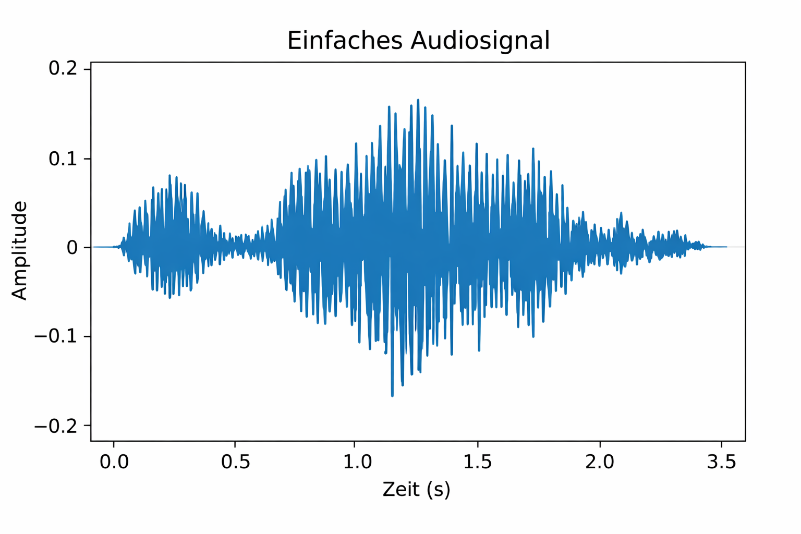
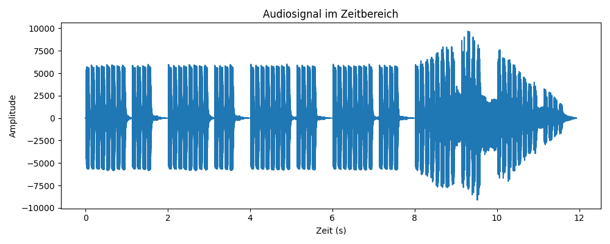
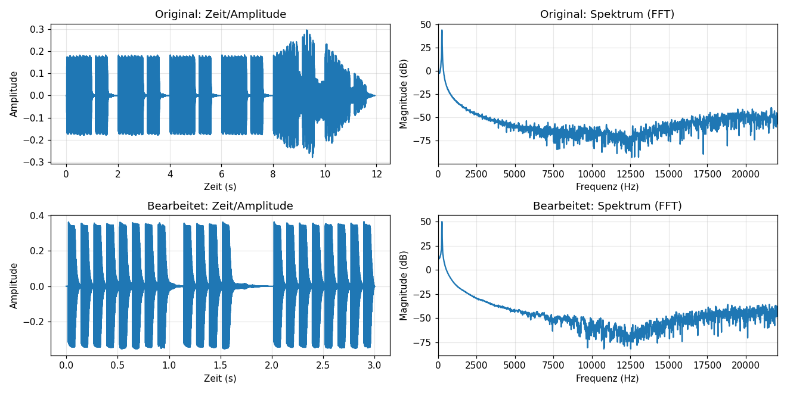
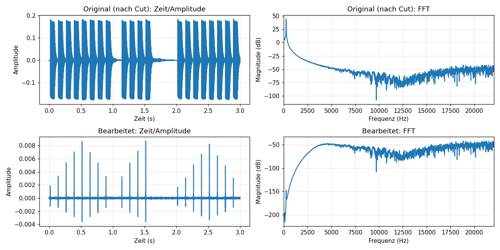

# Audio Verarbeitung mit numpy

## Einführung und Aufgabenstellung
Audiosignale können auf unterschiedliche Weise be- und verarbeitet werden. Ziel dieses Projekts ist es, ein Audiosignal aufzunehmen oder aus einer Datei zu laden, es anschließend digital zu bearbeiten (z.B. Cut/Trim, Gain, Filter) und sowohl im Zeit- als auch im Frequenzbereich anschaulich darzustellen. Außerdem wird eine Visualisierung umgesetzt, wie man sie aus der Praxis (Equalizer/Mischpult) kennt.

## Folgende Bibliotheken werden für die Audio Verarbeitung benötigt:

  ```sounddevice``` -> Play and Record Sound with Python (in meinem Fall Zugriff auf Mikro)
  
 ``` numpy``` -> NumPy ist eine Python-Bibliothek für schnelle    Berechnungen mit mehrdimensionalen Arrays (in meinem Fall für Audio Verarbeitung)
  
 ``` matplotlib``` -> zur Darstellung von Audio Aufzeichnungen
  
  ```scipy``` -> SciPy ist eine Python-Bibliothek für wissenschaftliches Rechnen, die auf Numpy aufbaut (in meinem Fall, falls aus einer Datei gelesen werden soll)
  
## Links:

[Python Lib](https://wiki.python.org/moin/Audio) Zuletzt besucht am: 13.01.2026

[Processing Audio with python](https://medium.com/@mateus.d.assis.silva/processing-audio-with-python-b6ec37ac2f40) Zuletzt besucht am: 13.01.2026

[ChatGPT](https://chatgpt.com/) Zuletzt besucht am: 10.02.2026

[Sounddevice](https://python-sounddevice.readthedocs.io/en/0.5.3/) Zuletzt besucht am: 10.02.2026

[Scypi](https://scipy.org/) Zuletzt besucht am: 10.02.2026

[Numpy](https://numpy.org/doc/stable/) Zuletzt besucht am: 10.02.2026

[Matplotlib](https://matplotlib.org/) Zuletzt besucht am: 10.02.2026

#### Wie ist ein Audiosignal "aufgebaut"?

Ein Audiosignal beschreibt Schall über die Zeit. Ein Mikrofon wandelt die Druckschwankungen der Luft in eine elektrische Spannung um, die sich ständig verändert. Digital wird dieses Signal als Folge von Messwerten (Samples) gespeichert: Die Samplerate gibt an, wie viele Samples pro Sekunde aufgenommen werden, die Bit-Tiefe bestimmt die Genauigkeit der Werte. Ein Audiosignal kann Mono (1 Kanal) oder Stereo (2 Kanäle: links/rechts) sein.

Programm befindet sich um Anhang -> [soundfile.py](soundfile.py)



## Wie wird Audio verarbeitet?

Siehe unter anderem Programmfortschritt -> [audiovisu_20.01](audiovisu_20.01.py) 

Das Audiosignal wird vom Mikrofon als zeitdiskretes Signal mit einer festen Samplerate aufgenommen und in einem Puffer gespeichert (Funktion pick_samplerate). Dieser Datenblock wird mit einer Fensterfunktion (Hann-Fenster) multipliziert, für Reduktion der Störeffekte bei der Fourieranalyse. Anschließend wird mittels FFT das Zeitsignal in den Frequenzbereich umgerechnet. Die Beträge der FFT werden in Dezibel (dB) umgerechnet und zu logarithmischen Frequenzbändern zusammengefasst. Diese Pegel werden zeitlich geglättet und als Balkendiagramm mit Peak-Hold-Anzeige dargestellt.

Darstellung erfolgt mittels Matplot-Lib.

Das Programm wurde nach dem Prinzip erweitert, alle Frequenzbereiche farblich darzustellen, ähnlich wie man es in der Praxis von Equalizern oder Mischpulten kennt.

Für weitere Details siehe Programmfortschritt -> [audiovisu_27.01](audiovisu_27.01.py) 

### Audioverarbeitung mit numpy

#### Wie werden die Daten in einer WAV-Datei gespeichert?

Eine WAV-Datei speichert Audio in zwei Teilen: zuerst kommt ein Header und danach kommen die eigentlichen Audiodaten. Im Header steht alles, was man zum Interpretieren der Daten braucht – also zum Beispiel die Samplerate (wie viele Messwerte pro Sekunde gespeichert werden), die Bit-Tiefe (wie genau ein Messwert gespeichert wird) und die Anzahl der Kanäle (Mono, Stereo oder mehr). Außerdem steht dort auch, wie groß der Datenbereich ist und in welchem Format das Signal abgelegt wurde.

Der Datenbereich besteht anschließend aus einer langen Folge von Samples. Ein Sample ist ein einzelner Messwert der Amplitude zu einem bestimmten Zeitpunkt. Sehr häufig sind diese Werte als Ganzzahlen gespeichert, zum Beispiel bei 16-Bit im Bereich von −32768 bis +32767. Manchmal werden auch 24-Bit oder 32-Bit verwendet, oder das Signal wird direkt als 32-Bit-Float gespeichert damit leichter gearbeitet werden kann.

Bei mehrkanaligem Audio (z.B. Stereo) werden die Samples meistens abwechselnd pro Kanal gespeichert. Das heißt: zuerst kommt der erste Messwert vom linken Kanal, dann der erste Messwert vom rechten Kanal, dann wieder links, dann rechts usw. Dadurch kann man beim Abspielen oder Einlesen das Signal wieder korrekt in die einzelnen Kanäle aufteilen.

Kurz gesagt: Der Header erklärt das Format, und danach folgen die Samples als Zahlenfolge, die das Audiosignal über die Zeit darstellen.

####  Wie werden die Daten in einer MP4-Datei gespeichert?

Eine MP4-Datei ist ein Containerformat. Das heißt: Sie enthält meist eine Videospur und eine Audiospur plus Metadaten. Bild und Ton liegen darin normalerweise komprimiert vor (z.B. Video als H.264/H.265, Audio als AAC). Zusätzlich speichert die MP4 Index- und Zeitinformationen, damit der Player weiß, wo die einzelnen Datenblöcke liegen und wann sie abgespielt werden müssen, damit Ton und Bild synchron bleiben.

#### Wie werden Daten auf einer CD gespeichert?

Eine Audio-CD speichert Musik im Vergleich zu MP4 nicht komprimiert und auch ohne Container/Tracks wie bei MP4. Auf einer CD liegt das Signal als PCM-Rohdaten vor – also direkt als Zahlenwerte für die Amplitude.

Das heißt: Eine CD ist vom Prinzip her eher wie eine WAV-Datei ohne Zusatzfunktionen, nur mit dem Dateisystem-Overhead und einer festen Struktur für Tracks. MP4 dagegen ist ein Container, der Audio/Video meist komprimiert speichert und zusätzlich Timing/Indexdaten für Synchronisation enthält.


#### Die audio.wav Datei ist 2,01MB in MP4 wäre sie ca. 0.2-0.3MB!

#### Wie kann ich ein Audiosignal von einer Datei öffnen?

NumPy allein liest keine Audioformate, man nutzt NumPy zum Verarbeiten, aber zum Einlesen braucht man Bibliotheken wie z.B. scipy, soundfile oder wave.

```from scipy.io import wavfile```

#### Wie werden die Daten in numpy gespeichert?

Nach dem Einlesen werden die Werte in x und fs gespeichert.

```fs, x = wavfile.read("audio.wav")``` 

x ... Array mit Amplitudenwerten welches Samples und Kanäle speichert

fs ... Samplingrate

#### Mono und Stereo Signale werden folgendermaßen gespeichert:

Mono Signal: ```x.shape == (N,)```
→ N Samples hintereinander

Stereo/Mehrkanal: ```x.shape == (N, C)```
→ N Samples, C -> wie viele Kanäle (z.B. 2)

Zugriff auf linker oder rechter Kanal:

```left  = x[:, 0]   # linker Kanal```

```right = x[:, 1]   # rechter Kanal```

Es können auch durchaus mehr als 2 Kanäle genutzt werden, um z.B. einen Surround mit 6 oder sogar 8 Kanälen zu erzeugen.

#### Worauf ist bei der Bearbeitung von Audiosignalen zu achten?

Beim Bearbeiten von Audiosignalen ist das Abtasttheorem wichtig: Ein Signal wird als viele einzelne Messwerte pro Sekunde gespeichert (Samplerate, z.B. 44,1 kHz oder 48 kHz). Damit man eine bestimmte maximale Frequenz im Signal korrekt darstellen kann, muss man mit mindestens der doppelten Frequenz abtasten (Samplerate ≥ 2 · f_max). Das bedeutet, man kann nur Frequenzen bis zur Hälfte der Samplerate korrekt darstellen (Nyquist-Grenze). Frequenzen darüber führen zu Aliasing, also “falschen” Frequenzen im unteren Bereich. Besonders beim Downsampling muss man deshalb vorher mit einem Tiefpass (Anti-Aliasing-Filter) alles oberhalb der neuen Nyquist-Grenze entfernen. Für FFT-Auswertungen nutzt man oft Fensterfunktionen (z.B. Hann, Rechteck, ...), damit das Spektrum sauberer und stabiler wird.

#### Viele WAVs (Soundfiles) kommen als Integer:

Die Samples einer WAV-Datei kommen oft als Integer (meist int16). Diese Werte liegen z.B. im Bereich -32768 … +32767 und werden für die Bearbeitung meist in float (typisch -1…+1) umgewandelt, weil Rechenoperationen (Gain, Filter, FFT) einfacher/sicherer sind.

int32 -> im Sonderfall

#### Was bedeutet Audiobearbeitung?
Audio­bearbeitung bedeutet, ein Audiosignal gezielt zu verändern, um es z.B. zu verbessern, anzupassen oder zu analysieren. Typische Schritte sind:

Cut/Trim: einen Abschnitt ausschneiden oder Stille am Anfang/Ende entfernen.



Programm für CUT/TRIM und Lauter/leiser befindet sich im Anhang 

-> [soundfilewithfeatures.py](soundfilewithfeatures.py) -> ```cut_audio``` und ```apply_gain_db```



Normalisieren: so verstärken, dass das Signal möglichst laut ist, ohne zu clippen.

Filtern: bestimmte Frequenzbereiche verändern, z.B. Tiefen/Höhen betonen oder Störgeräusche entfernen (Lowpass/Highpass/Bandpass).

Programm befindet sich im Anhang -> [soundfilewithfilter.py](soundfilewithfilter.py) 




```FILTER_MODE = "none"``` ... Keine Filter

```FILTER_MODE = "high"``` ... nur Höhen

```FILTER_MODE = "low"``` ... nur Tiefen (Bass)

```FILTER_MODE = "mid"``` ... nur Mitten

Der Filtermode kann über die oben angegebenen Code-Zeilen in den "Einstellungen des Programmes verändert werden.